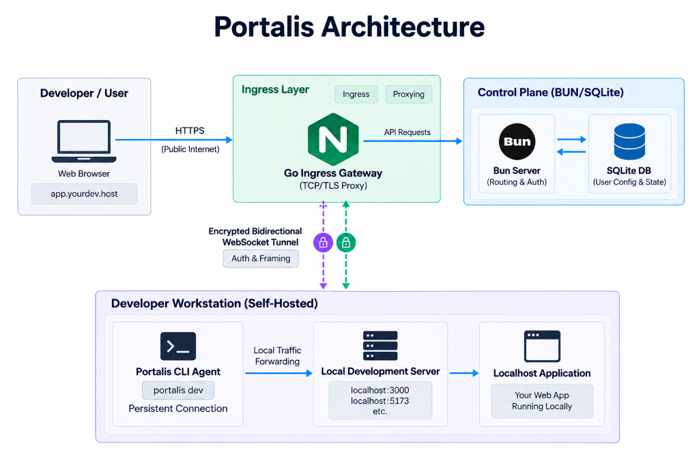

# Portalis

Self-hosted developer connectivity and tunneling platform for securely exposing local services to the internet.

---

## Why Portalis?

Developers frequently need to expose local development servers (`localhost:3000`, `localhost:8080`) to the public internet to test webhooks (Stripe, GitHub, Shopify), demo features to teammates or clients, and debug mobile applications.

Proprietary solutions like Ngrok and Cloudflare Tunnel impose restrictive rate limits, assign random ephemeral URLs on free tiers, or require closed-source agent installations.

Portalis automates the pipeline:

- **Ingress & Multiplexing**: Accepts public HTTP requests on vanity subdomains and streams them over an encrypted, bidirectional WebSocket tunnel.
- **Local Forwarding**: The lightweight Go CLI agent forwards requests to your local port and returns responses in milliseconds.
- **Self-Hosted Control**: Complete ownership of your tunnels, custom subdomains, and data with zero subscription fees.

---

## Features

- **High-Concurrency Go Gateway**: Wildcard HTTP routing with bidirectional WebSocket frame multiplexing.
- **Cross-Platform CLI Agent**: Lightweight, single-binary Go CLI (`portalis`) with zero external runtime dependencies.
- **Passwordless OTP Authentication**: Secure 2-step email verification with JWT session lifecycle.
- **Custom Vanity Subdomains**: Self-service subdomain reservation with collision detection and keyword blocklists.
- **Embedded SQLite (WAL Mode)**: Zero-ops relational storage operating in high-performance Write-Ahead Logging mode.
- **Management UI**: Built-in React 18 dashboard to manage active tunnels, generate agent tokens, and monitor sync status.

---

## Architecture Overview



```
[ Developer / User ]
         │
         │ HTTPS (Public Internet)
         ▼
[ Go Ingress Gateway ] ◄─── API Requests ───► [ Control Plane (Bun/SQLite) ]
(TCP/TLS Proxy)                                 ├── Bun Server (Routing & Auth)
         │                                      └── SQLite DB (Config & State)
         │
         │ Encrypted Bidirectional
         │ WebSocket Tunnel
         ▼
[ Developer Workstation ]
         │
         ├── Portalis CLI Agent (portalis dev)
         ▼
[ Localhost Application (localhost:3000 / localhost:5173) ]
```

---

## Quickstart

### Prerequisites

- Go >= 1.23
- Bun >= 1.1
- Node.js >= 18.0
- Git

### 1. Clone & Install Dependencies

```bash
git clone https://github.com/dineTH2003-dev/Portalis.git
cd Portalis

# Install Control Plane & Dashboard dependencies
cd apps/server && bun install
cd ../client && bun install
cd ../..
```

### 2. Configure Environment

Copy the example environment files:

```bash
# Control Plane environment
cp apps/server/.env.example apps/server/.env

# React Dashboard environment
cp apps/client/.env.example apps/client/.env
```

Configure your ports and secrets in `apps/server/.env`:

```env
PORT=4310
DATABASE_URL="./portalis.db"
JWT_ACCESS_SECRET="your-access-secret"
JWT_REFRESH_SECRET="your-refresh-secret"
INTERNAL_GATEWAY_SECRET="your-gateway-secret"
```

### 3. Start Database & Apply Migrations

```bash
cd apps/server
bun run migrate
cd ../..
```

### 4. Start the Application

Run the services concurrently from the root directory:

```bash
# Terminal 1: Start Bun Control Plane
make run-server

# Terminal 2: Start Go Ingress Gateway
make run-gateway

# Terminal 3: Start Web Dashboard
make run-client
```

The web dashboard runs at `http://localhost:5310`, the control plane API runs at `http://localhost:4310`, and the ingress gateway listens on `http://localhost:8080`.

---

## Client Integration

Once an agent token is generated via the web dashboard, connect your local services using the Portalis CLI.

### 1. Authenticate the CLI

```bash
./bin/portalis login <YOUR_AGENT_TOKEN>
```

### 2. Expose a Local Service

```bash
./bin/portalis http 3000 --subdomain myapp
```

### Status Output

```text
┌────────────────────────────────────────────────────────┐
│ Portalis Tunnel Online                                 │
│ Public Ingress:  https://myapp.yourdomain.com          │
│ Forwarding to:   http://localhost:3000                 │
│ Status:          CONNECTED                             │
└────────────────────────────────────────────────────────┘
```

---

## Contributing

Please see our **[Contributing Guidelines](CONTRIBUTING.md)** for our branching workflow, commit standards, and local verification procedures.

- **[Architecture Specification](docs/Architecture.md)**
- **[Development Backlog](docs/Backlog.md)**
- **[Technology Stack](docs/TechStack.md)**

---

## License

Portalis is licensed under the [MIT License](LICENSE).
